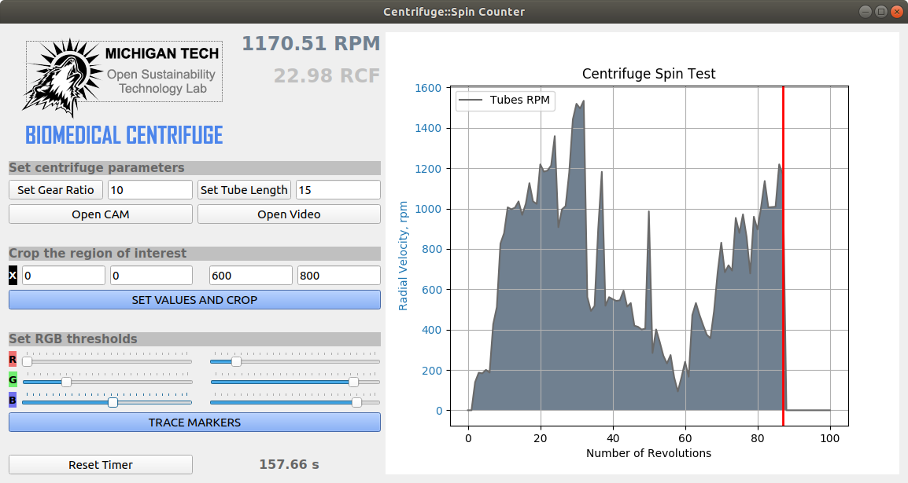

# MOST_Centrifuge_GUI
A camera-based GUI application to validate the rotational speed of an open source 3D printable centrifuge.

As the working part of the centrifuge rotates at a speed of up to 2000 rpm, it may be difficult to
track its motion since the majority of regular web cameras are operating at a frequency of 25-30 Hz.
Thus, as the whole system represents a mechanical transmission with the fixed gear ratio, an
indirect method was chosen to calculate the angular velocity of the tubes based on the speed of
rotation of the centrifuge handle (Figure 6).
A Python-based software was developed to automatically measure the rotational speed of the
centrifuge. Were utilized OpenCV library for segmentation and tracking a visual marker located on
the centrifuge handle, and PyQt library for creating a guide user interface application (Figure 7).

The developed application allows to crop an arbitrary region of interest of the captured camera
frame and set RGB thresholds for tracking the visual markers of any distinctive colors. It counts the
number of centrifuge handle revolutions and calculates angular velocity of the tubes. With the given
information about the tube length, the program also computes its relative centrifugal force. In case
of manual rotation, the central marker will be periodically covered by a hand, so it is possible to set
the x and y coordinates of the origin point in the program code.
