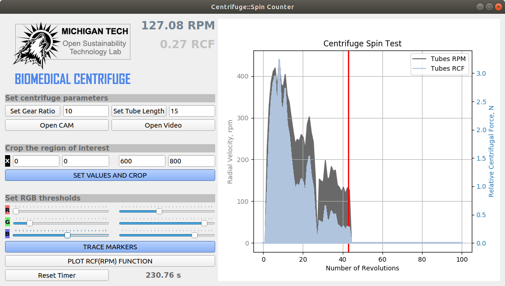

# A camera-based GUI application to validate the rotational speed of an open source 3D printable centrifuge.

 >*The provided application is a part of an "Open Source Completely 3-D Printable Centrifuge" paper by Salil S. Sule, Aliaksei L. Petsiuk and Joshua M. Pearce.*
 

As the working part of a centrifuge rotates at a speed of up to 2000 rpm, it may be difficult to track its motion since the majority of regular web cameras are operating at a frequency of 25-30 Hz. Thus, as the whole system represents a mechanical transmission with the fixed gear ratio, an indirect method was chosen to calculate the angular velocity of the tubes based on the speed of rotation of the centrifuge handle (Figure 1). A Python-based software was developed to automatically measure the rotational speed of the centrifuge. Were utilized OpenCV library for segmentation and tracking a visual marker located on the centrifuge handle, and PyQt library for creating a guide user interface application (Figure 2).

**Figure 1.** Image-based markers segmentation a) Cropped frame of the centrifuge with the
visual markers, b) Masked image c) Calculated handle orientation.
 

The developed application allows to crop an arbitrary region of interest of the captured camera frame and set RGB thresholds for tracking the visual markers of any distinctive colors. It counts the number of centrifuge handle revolutions and calculates angular velocity of the tubes. With the given information about the tube length, the program also computes its relative centrifugal force. In case of manual rotation, the central marker will be periodically covered by a hand, so it is possible to set the x and y coordinates of the origin point in the program code.

**Figure 2.** An application for camera-based RPM and RCF calculations

 

The main computer vision algorithm is provided below. The RPM and RCF calculations are based on tracking the coordinates of the traveler marker located on the centrifuge handle. By applying the specified color thresholds and morphological operations of “opening” and “closing” to a cropped camera frame we can mask the marker as a single separated color region. To find the coordinates of its centroid we employ the method of moments, which will allow us to compute the centrifuge handle orientation relatively to the center of rotation.

**Figure 3.** A processed video frame

 

*RPM = 60 * G / dt,* where RPM – rotational velocity of the tubes in rpm, G – gear ratio, dt – time interval for a single
revolution in seconds.

*RCF = 1.118 * D * RPM^2 / 10^6*, where RCF – relative centrifugal force in Newtons, D – length of the test tube with the radius of the centrifuge rotor in mm.

 

- - - -
**The main algorithm for computing angular velocity and relative centrifugal force**
- - - -
**Input:** an image frame from a camera or a video sequence  
**Output:** RPM and RCF values for the test tubes  
- - - -
**while** a camera is open or a video is reading **do:**  
&nbsp;&nbsp;&nbsp;&nbsp;&nbsp;&nbsp;get a single frame as an RGB image  
&nbsp;&nbsp;&nbsp;&nbsp;&nbsp;&nbsp;crop the region of interest of the image frame  
&nbsp;&nbsp;&nbsp;&nbsp;&nbsp;&nbsp;apply linear filtering to blur the cropped region  
&nbsp;&nbsp;&nbsp;&nbsp;&nbsp;&nbsp;mask color marker using RGB thresholds  
&nbsp;&nbsp;&nbsp;&nbsp;&nbsp;&nbsp;apply operations of opening and closing to remove noise after RGB masking  
&nbsp;&nbsp;&nbsp;&nbsp;&nbsp;&nbsp;find the contours of the masked area <b/>

 

&nbsp;&nbsp;&nbsp;&nbsp;&nbsp;&nbsp;&nbsp;&nbsp;&nbsp;&nbsp;&nbsp;&nbsp; **if** the traveler marker is detected **do:**  
&nbsp;&nbsp;&nbsp;&nbsp;&nbsp;&nbsp;&nbsp;&nbsp;&nbsp;&nbsp;&nbsp;&nbsp;&nbsp;&nbsp;&nbsp;&nbsp;&nbsp;&nbsp;find the centroid location of the color marker applying the method of moments  
&nbsp;&nbsp;&nbsp;&nbsp;&nbsp;&nbsp;&nbsp;&nbsp;&nbsp;&nbsp;&nbsp;&nbsp;&nbsp;&nbsp;&nbsp;&nbsp;&nbsp;&nbsp;calculate the radius of rotation and the angle of the centrifuge arm  
 
&nbsp;&nbsp;&nbsp;&nbsp;&nbsp;&nbsp;&nbsp;&nbsp;&nbsp;&nbsp;&nbsp;&nbsp;&nbsp;&nbsp;&nbsp;&nbsp;&nbsp;&nbsp; **if** the angle is in a specified zero range **do:**  
&nbsp;&nbsp;&nbsp;&nbsp;&nbsp;&nbsp;&nbsp;&nbsp;&nbsp;&nbsp;&nbsp;&nbsp;&nbsp;&nbsp;&nbsp;&nbsp;&nbsp;&nbsp;&nbsp;&nbsp;&nbsp;&nbsp;&nbsp;&nbsp;increase number of revolutions by one  
&nbsp;&nbsp;&nbsp;&nbsp;&nbsp;&nbsp;&nbsp;&nbsp;&nbsp;&nbsp;&nbsp;&nbsp;&nbsp;&nbsp;&nbsp;&nbsp;&nbsp;&nbsp;&nbsp;&nbsp;&nbsp;&nbsp;&nbsp;&nbsp;update timer and compute the time period for one revolution  
&nbsp;&nbsp;&nbsp;&nbsp;&nbsp;&nbsp;&nbsp;&nbsp;&nbsp;&nbsp;&nbsp;&nbsp;&nbsp;&nbsp;&nbsp;&nbsp;&nbsp;&nbsp;&nbsp;&nbsp;&nbsp;&nbsp;&nbsp;&nbsp;calculate the tubes RPM  
&nbsp;&nbsp;&nbsp;&nbsp;&nbsp;&nbsp;&nbsp;&nbsp;&nbsp;&nbsp;&nbsp;&nbsp;&nbsp;&nbsp;&nbsp;&nbsp;&nbsp;&nbsp;&nbsp;&nbsp;&nbsp;&nbsp;&nbsp;&nbsp;calculate the tubes RCF  
&nbsp;&nbsp;&nbsp;&nbsp;&nbsp;&nbsp;&nbsp;&nbsp;&nbsp;&nbsp;&nbsp;&nbsp;&nbsp;&nbsp;&nbsp;&nbsp;&nbsp;&nbsp; **end if**  
&nbsp;&nbsp;&nbsp;&nbsp;&nbsp;&nbsp;&nbsp;&nbsp;&nbsp;&nbsp;&nbsp;&nbsp; **end if**  
 **end while**  
- - - -

 

**Figure 4.** Relative Centrifugal Force as a function of radial velocity

 
 

© 2019 by the authors. Submitted for possible open access publication under the terms and conditions of the Creative Commons Attribution (CC BY) license (http://creativecommons.org/licenses/by/4.0/).
&nbsp;
  &nbsp;
